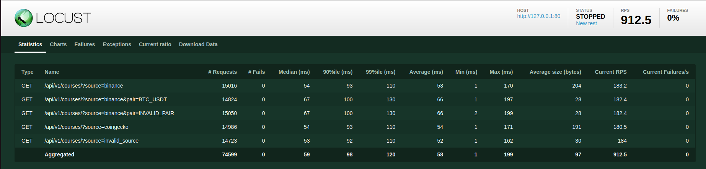

## Предварительные требования

Прежде чем начать, убедитесь, что у вас установлены следующие компоненты:

- Docker: [Инструкции по установке Docker](https://docs.docker.com/get-docker/)
- Docker Compose: [Инструкции по установке Docker Compose](https://docs.docker.com/compose/install/)

## Запуск приложения

1. Склонируйте репозиторий с исходным кодом, если вы еще этого не сделали:

   ```bash
   git clone https://github.com/bucin98/fast_api_coin_price
   cd repository
   ```

2. Создайте файл `.env` в корневом каталоге проекта и укажите необходимые переменные окружения. Например:

   ```
   POSTGRES_DB=db_name
   DB_USER=username
   DB_PASSWORD=password
   ```

3. Запустите Docker Compose с помощью следующей команды:

   ```bash
   docker-compose up -d --build
   ```

4. Чтобы остановить контейнеры, выполните следующую команду:

   ```bash
   docker-compose down
   ```

## Добавление валютных пар

Для отслеживаня валютной пары необходимо добавить ее в дб.

Формат:

```
name = отображаемое название пары (BTC-USD)
binance_name = имя для получения пары через WS бинанса (btcusdt)
coingeko_name = имя для полученя пары через API coingecko (bitcoin-usdt)
```

## Эндпоинты

- **URL**: `/api/v1/courses/`
- **Метод**: GET

### Параметры

- `pair` (необязательный): Строка с названием пары, для которой нужно получить информацию о курсе.
- `source` (необязательный): Источник данных (по умолчанию "binance"). Допустимые значения: "binance", "coingecko".

### Примеры запросов

#### Получение всех курсов

```http
GET /api/v1/courses/
```

#### Получение курса для конкретной пары

```http
GET /api/v1/courses/?pair=BTC-USDT
```

### Пример ответа

```json
{
  "exchanger": "binance",
  "courses": [
    {
      "direction": "BTC-USD",
      "value": "50000.0",
      "time": "2023-10-26T12:34:56"
    },
    {
      "direction": "ETH-USD",
      "value": "4000.0",
      "time": "2023-10-26T12:34:56"
    }
  ]
}

```

### Результат тестирования Locust:

